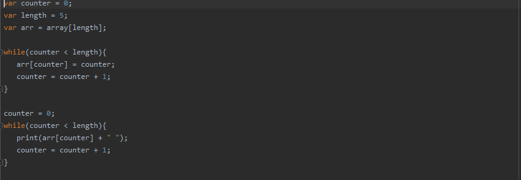
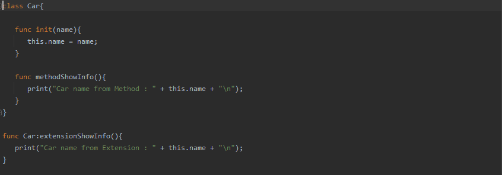
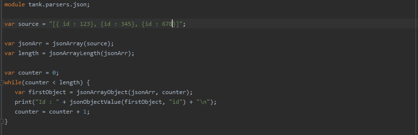
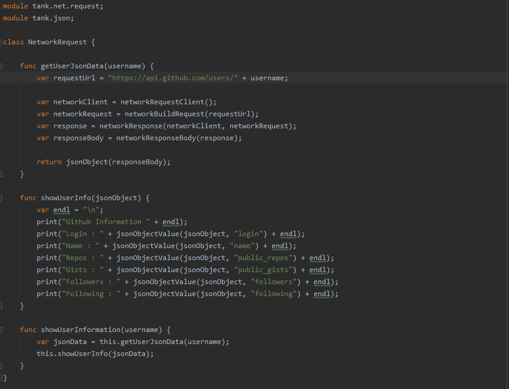
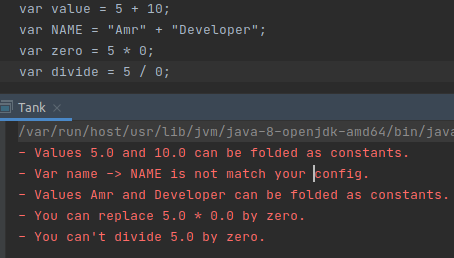

# Tank

## It's Dynamic type Object oriented and scripting language written in Java

## Features
- import native modules
- Classes
- Array data structure with dynamic types
- Single Inheritance like Java
- this keyword
- Methods
- Functions
- Function Extenson
- Local functions
- Native Functions
- Ternary (X ? Y : Z) and Elvis (X ? Y) Operators
- If condition
- While loop
- Do While Loop
- Repeat block like Kotlin
- Scope and Block
- super, this keywords for oop
- Break and Continue keyword for loops
- Logical operators AND, OR, XOR
- Bitwise operators <<, >>, >>>
- Function can take other Function as Parameter
- Runtime error
- Semantic analysis
- Arity Similar to Python that throw error if developer pass less or more than function arguments
- Create custom prefix operators
- Create custom infix Operators

##### Arrays


##### Function Extension.


##### Parse Json.


##### Make Network Request.


##### Get system information.
```
module tank.system;

print("Current os name is : " + osName() + "\n");

print("JDK Path : " + osEnvVar("JAVA_HOME") + "\n");

print("OS Arch : " + osArch() + "\n");
```

##### Test statement to show request result in the runtime.
```
func sum(x, y) {
   return x + y;
}

test ("test sum function") {
   return sum(1, 1) == 2;
}
```

##### Custom infix Operator function
```
infix func sum(x, y) {
   return x + y;
}

var sumResult = 10 sum 20;     // will be 30
var sumResult2 = sum(10, 20);  // will be 30
```

##### Custom prefix Operator function
```
prefix func multiByTen(x) {
   return x * 10;
}

var result = multiByTen 10;    // will be 100
var result2 = multiByTen(10);  // will be 100
```

##### Example of Infix and prefix functions
```
prefix func say(message) {
   print(message + "\n");
}

infix func to(left, right) {
   return left + " " + right;
}

// Option 1
say "Hello" to "Amr";

// Option 2
say(to("Hello", "Amr"));
```


## Tools:
#### Code Style Check for Tank code to check if your code style is match your check configuration
- Check class name and super class name.
- Check method name and parameters.
- Check function name and parameters.
- Check function extension name and parameters.
- Check variables name.
- Check test block tag.
- Check if constants folding is possible.

#### For Example.  


#### For all Examples see examples directory.
