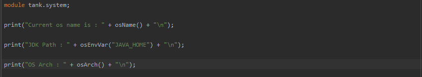
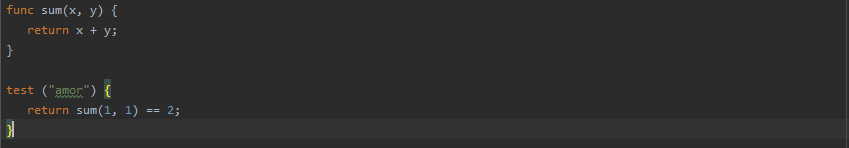

# Tank

## It's Dynamic type Object oriented and scripting language written in Java
## Porting version of Jlox

## Features
- import native modules
- Classes
- Array data structure with dynamic types
- Single Inheritance like Java
- this keyword
- Methods
- Functions
- Function Extenson
- Local functions
- Native Functions
- Ternary (X ? Y : Z) and Elvis (X ? Y) Operators
- If condition
- While loop
- Do While Loop
- Repeat block like Kotlin
- Scope and Block
- super, this keywords for oop
- Break and Continue keyword for loops
- Logical operators AND, OR, XOR
- Bitwise operators <<, >>, >>>
- Function can take other Function as Parameter
- Runtime error
- Semantic analysis
- Arity Similar to Python that throw error if developer pass less or more than function arguments

##### Arrays

##### Function Extension.

##### Parse Json.

##### Make Network Request.

##### Get system information.

##### Test statement to show request result in the runtime.

## Tools:
#### Code Style Check for Tank code to check if your code style is match your check configuration
- Check class name and super class name.
- Check method name and parameters.
- Check function name and parameters.
- Check function extension name and parameters.
- Check variables name.
- Check test block tag.
- Check if constants folding is possible.

#### For Example.  

#### For all Examples see examples directory.
